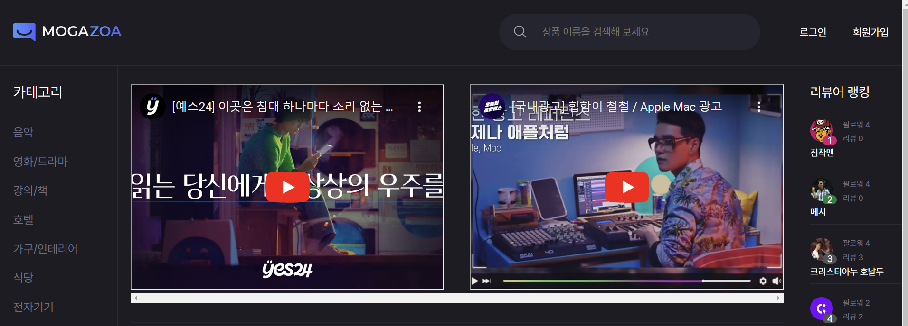

  

  

# 💻 프로젝트 개요

음악, 식당, 영화, 강의, 여행지, 전자기기, 호텔, 와인, 옷, 앱 등 다양한 분야의 상품을 리뷰하는 플랫폼

### 🔧 배포링크

> [Mogazoa](https://mogazoa4-1.vercel.app/)

  

# 👪 팀원 소개

<table>
    <tr align="center">
        <td></td>
        <td></td>
        <td></td>
        <td></td>
    </tr>
    <tr align="center">
      <td><a href="https://github.com/Song-Sang">송상훈</a></td>
      <td><a href="https://github.com/siyeol97">이시열</a></td>
      <td><a href="https://github.com/whtjdrud">조성경</a></td>
      <td><a href="https://github.com/Crack-Egg">이재명</a></td>
    </tr>
    <tr align="center">
      <td>팀장</td>
      <td>팀원</td>
      <td>팀원</td>
      <td>팀원</td>
    </tr>
</table>

  

# 📆 개발 기간

### 2024.04.11 ~ 2024.05.17 (약 5주)

  

# ✨ 기술 스택

### 개발

  
  
  
  
  

 

### 라이브러리

  
  
  
  
  
  

 

### 협업

  
  
  
  
  

### 배포

  

# ⚙️ 주요 기능

### 📄 메인페이지 및 로그인/회원가입 페이지

- UX/UI 개선을 위한 메인페이지 제작
-

### 📄 상품 상세 페이지

- 카카오톡 공유, 찜, url 복사 기능
- 상품 정보 배열에 저장해 각각 카드 컴포넌트로 구현
- 쿠기 정보를 통해 리뷰 수정 및 삭제 기능 구현

### 📄 프로필 페이지

- useInfinitieQuery를 이용하여 유저 팔로우 기능 구현
- react-hook-form을 이용한 유저 프로필 페이지 구현
- 유저 프로필 내 상품 무한 스크롤 기능 및 팔로우 취소 기능 구현
- 팔로우 목록 모달 구현

### 📄 비교하기 페이지

- 상품 별 좋아요, 찜, 리뷰에 대한 상품 비교 기능
- 비교 등록한 상품 계속 유지
- 상품 비교 모달을 통해 상품이 모두 등록해 있을 때 교체 모달로 변경

### 📄 공통

- 모달창의 상태 관리 및 카카오톡 간편 회원가입/로그인 기능(Zustand)
- react-query를 이용한 API 호츌
- nprogress 라이브러리를 이용한 페이지 렌더링 상태 구현
- react-query를 이용한 상품 추가 및 수정 모달
- scss 변수 분리(globals/main/mixins)

  

# ⛓️ 추가기능

- UX/UI 개선을 위한 스켈레톤 UI 추가
- 페이지 렌더링 상태를 보여주기 위한 Nprogress 라이브러리 기능 추가

  
